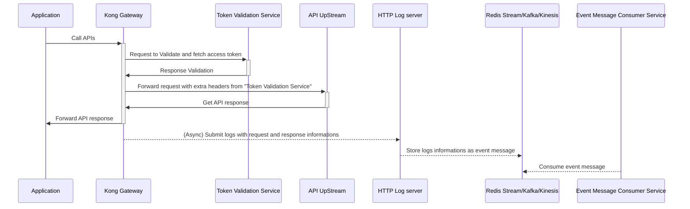

# kong-http-log-to-event
Logging kong http request/response to event streams



## How to test
- Run `make docker-compose-build`
- Run `make docker-compose-up`
- Run `make call-apis`
- Or Run `make load-test` to test with bunch of requests
- Check request log at [`http://localhost:8000/consumer`](http://localhost:8000/consumer)

## Commands

### Check request URL in redis streams
```bash
echo XRANGE mockoon-one - + | redis-cli -h 127.0.0.1 -p 16379 | grep "service" | jq -s '.[].request.url'
```

### Check request headers in redis streams
```bash
echo XRANGE mockoon-one - + | redis-cli -h 127.0.0.1 -p 16379 | grep "service" | jq -s '.[].request.headers'
```

## References
- Original kong plugin, [kong-plugin-http-log-with-body](https://github.com/zenvia/kong-plugin-http-log-with-body)
- Go library for working efficiently with message streams, [Watermill](https://watermill.io)
- Command line tool that runs HTTP requests, [Hurl](https://hurl.dev/)
- HTTP load testing tool and library, [Vegeta](github.com/tsenart/vegeta)


## Documentation

